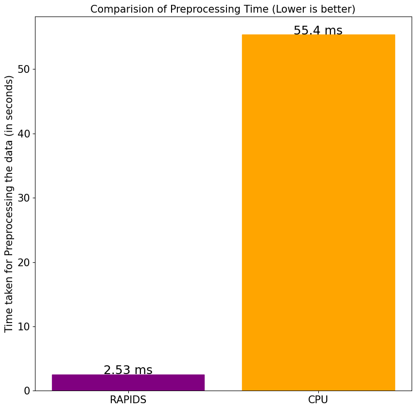
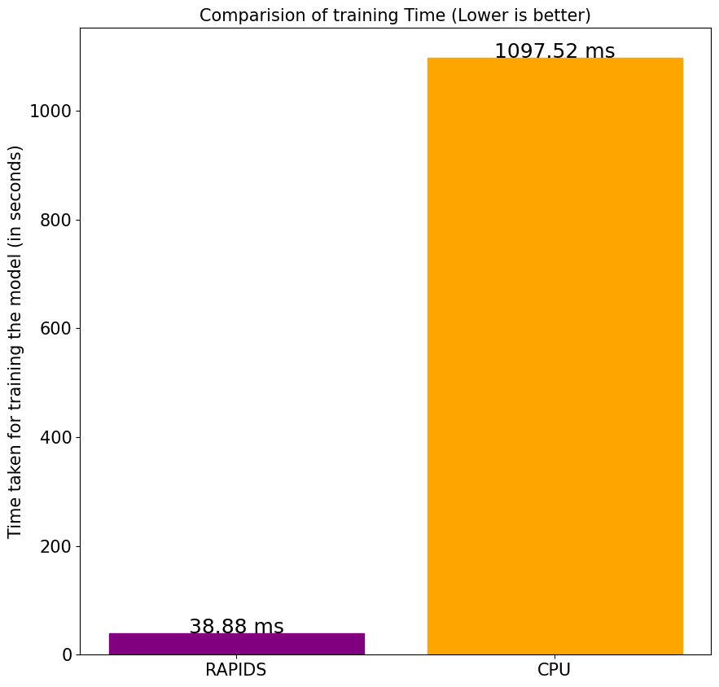
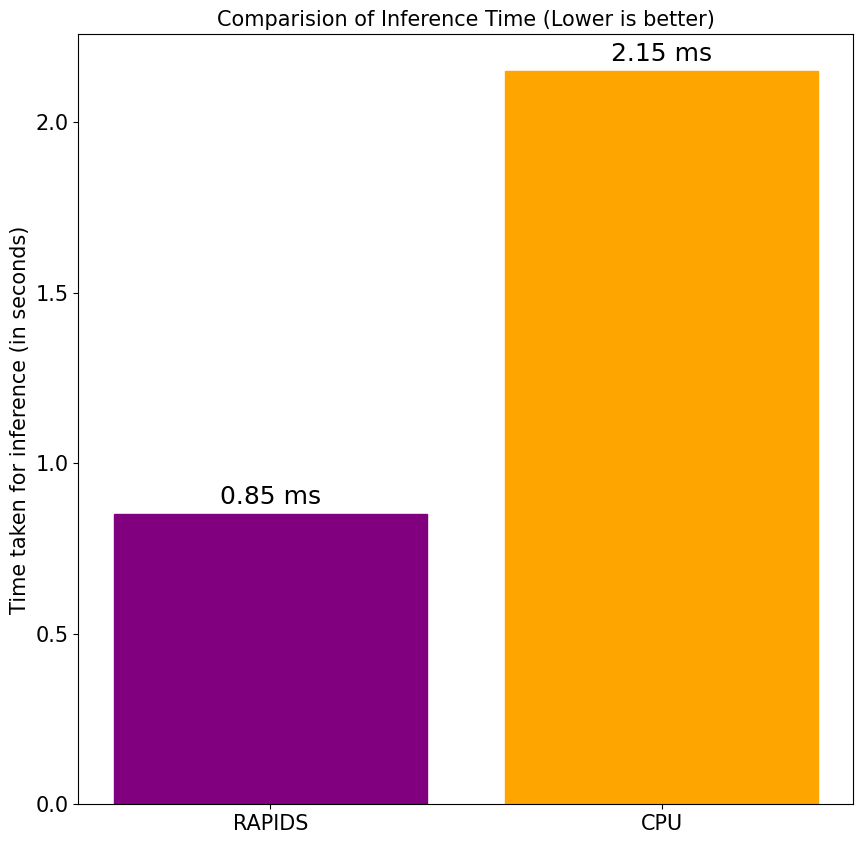

[![Contributors][contributors-shield]][contributors-url]
[![Issues][issues-shield]][issues-url]
[![MIT License][license-shield]][license-url]
[![LinkedIn][linkedin-shield]][linkedin-url]
<!-- [![Forks][forks-shield]][forks-url]
[![Stargazers][stars-shield]][stars-url] -->

<!-- PROJECT LOGO -->
 

  

  <h2 align="center">Fraud Detection using RAPIDS</h2>

  

    A fraud detection model using XGBoost GPU algorithm on the IEEE-CIS Fraud Detection dataset.
     
    <!-- <a href="https://github.com/deeprodge/Resnet50-with-TensorRT"><strong>Explore the docs »</strong></a>
     
     
    <a href="https://github.com/deeprodge/Resnet50-with-TensorRT">View Demo</a>
    · -->
    <a href="https://github.com/deeprodge/Resnet50-with-TensorRT/issues">Report Bug</a>
    ·
    <a href="https://github.com/deeprodge/Resnet50-with-TensorRT/issues">Request Feature</a>
  

<!-- TABLE OF CONTENTS -->

  
Table of Contents

  <ol>
    <li>
      <a href="#about-the-project">About The Project</a>
      <ul>
        <li><a href="#built-with">Built With</a></li>
      </ul>
    </li>
    <li>
      <a href="#getting-started">Getting Started</a>
      <ul>
        <li><a href="#prerequisites">Prerequisites</a></li>
        <!-- <li><a href="#installation">Installation</a></li> -->
      </ul>
    </li>
    <li><a href="#usage">Usage</a></li>
    <!-- <li><a href="#roadmap">Roadmap</a></li> -->
    <li><a href="#contributing">Contributing</a></li>
    <li><a href="#license">License</a></li>
    <li><a href="#contact">Contact</a></li>
    <li><a href="#useful-resources">Useful Resources</a></li>
  </ol>

<!-- ABOUT THE PROJECT -->
## About The Project
 

This project involved building a GPU-accelerated machine learning pipeline for fraud detection using RAPIDS and XGBoost. By leveraging GPUs for data preprocessing and modeling, it achieved 22x speedup over Pandas and Scikit-Learn on CPUs. The XGBoost model trained on GPUs obtained 0.843 PR_AUC on the IEEE-CIS Fraud Detection benchmark dataset.

(<a href="#top">back to top</a>)

### Built With

* [Python](https://www.python.org/)
* [RAPIDS](https://docs.rapids.ai/)
* [XGBoost](https://xgboost.readthedocs.io/en/stable/index.html)
* [NumPy](https://numpy.org/)
* [Pandas](https://pandas.pydata.org/)
* [Pillow](https://pillow.readthedocs.io/en/stable/)

(<a href="#top">back to top</a>)

<!-- ROADMAP -->
<!-- ## Roadmap

- [x] Add Changelog
- [x] Add back to top links
- [ ] Add Additional Templates w/ Examples
- [ ] Add "components" document to easily copy & paste sections of the readme
- [ ] Multi-language Support
    - [ ] Chinese
    - [ ] Spanish

See the [open issues](https://github.com/deeprodge/Resnet50-with-TensorRT/issues) for a full list of proposed features (and known issues).

(<a href="#top">back to top</a>)
 -->

<!-- CONTRIBUTING -->
## Contributing

Contributions are what make the open source community such an amazing place to learn, inspire, and create. Any contributions you make are **greatly appreciated**.

If you have a suggestion that would make this better, please fork the repo and create a pull request. You can also simply open an issue with the tag "enhancement".
Don't forget to give the project a star! Thanks again!

1. Fork the Project
2. Create your Feature Branch (`git checkout -b feature/AmazingFeature`)
3. Commit your Changes (`git commit -m 'Add some AmazingFeature'`)
4. Push to the Branch (`git push origin feature/AmazingFeature`)
5. Open a Pull Request

(<a href="#top">back to top</a>)

<!-- LICENSE -->
## License

Distributed under the MIT License. See `LICENSE` for more information.

(<a href="#top">back to top</a>)

<!-- CONTACT -->
## Contact

Deep Rodge - [LinkedIn](https://linkedin.com/in/deeprodge) - deeprodge14@gmail.com

Project Link: [https://github.com/deeprodge/Resnet50-with-TensorRT](https://github.com/deeprodge/Resnet50-with-TensorRT)

(<a href="#top">back to top</a>)

<!-- ACKNOWLEDGMENTS -->
## Useful Resources

* [RAPIDS Documentation](https://docs.rapids.ai/)
* [PyTorch NGC Container](https://xgboost.readthedocs.io/en/stable/index.html)
* [IEEE-CIS Fraud Detection Dataset](https://www.kaggle.com/competitions/ieee-fraud-detection/)

(<a href="#top">back to top</a>)

<!-- MARKDOWN LINKS & IMAGES -->
<!-- https://www.markdownguide.org/basic-syntax/#reference-style-links -->
[contributors-shield]: https://img.shields.io/github/contributors/deeprodge/Resnet50-with-TensorRT.svg?style=for-the-badge
[contributors-url]: https://github.com/deeprodge/Resnet50-with-TensorRT/graphs/contributors
[forks-shield]: https://img.shields.io/github/forks/deeprodge/Resnet50-with-TensorRT.svg?style=for-the-badge
[forks-url]: https://github.com/deeprodge/Resnet50-with-TensorRT/network/members
[stars-shield]: https://img.shields.io/github/stars/deeprodge/Resnet50-with-TensorRT.svg?style=for-the-badge
[stars-url]: https://github.com/deeprodge/Resnet50-with-TensorRT/stargazers
[issues-shield]: https://img.shields.io/github/issues/deeprodge/Resnet50-with-TensorRT.svg?style=for-the-badge
[issues-url]: https://github.com/deeprodge/Resnet50-with-TensorRT/issues
[license-shield]: https://img.shields.io/github/license/deeprodge/Resnet50-with-TensorRT.svg?style=for-the-badge
[license-url]: https://github.com/deeprodge/Resnet50-with-TensorRT/blob/main/LICENSE
[linkedin-shield]: https://img.shields.io/badge/-LinkedIn-black.svg?style=for-the-badge&logo=linkedin&colorB=555
[linkedin-url]: https://linkedin.com/in/deeprodge
[product-screenshot]: images/screenshot.png
